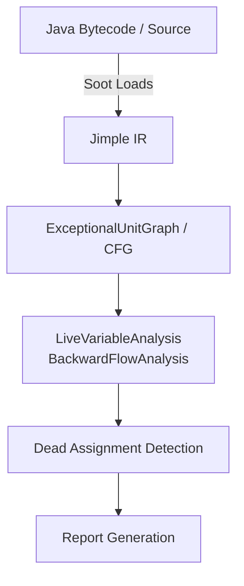

# IPACO Project 2: Intra-Procedural Static Analysis for Detecting Dead Variables

## Problem Statement

**Goal:** Detect "dead variable" patterns in buggy Java programs — where a variable is assigned a value but never used before being overwritten or the function exits. This pattern indicates the **wrong variable** is being used downstream, which is a critical bug category for Automated Program Repair (APR).

**Example (from project spec):**
```java
public Paint getPaint(double value) {
    double v = Math.max(value, this.lowerBound);
    v = Math.min(v, this.upperBound);           // v is correctly clamped
    int g = (int) ((value - this.lowerBound) /  // BUG: uses 'value' not 'v'
            (this.upperBound - this.lowerBound) * 255.0);
    return new Color(g, g, g);                  // throws if g outside [0,255]
}
```
Here `v` at line 3 is **dead** — it is defined but never read again. The bug is that `value` was used instead of `v` at line 4.

## Three Project Tasks

| # | Task | Description |
|---|------|-------------|
| 1 | **Dataset Analysis** | Analyze Defects4J 1.2 and 2.0 (~854 bugs) to find all bugs sharing the dead-assignment pattern |
| 2 | **Implement Analysis Pass** | Build a Soot Jimple analysis pass that automatically detects dead assignments |
| 3 | **Evaluation** | Use the dataset to evaluate the solution's precision and recall |

---

## User Review Required

> [!IMPORTANT]
> **LLVM vs Soot:** Your project PDF specifies using **Soot framework** (Java bytecode analysis on Jimple IR), NOT LLVM. Your existing LLVM setup from Project 1 won't be used here. This project is entirely Java-based. Please confirm you're okay with this.

> [!IMPORTANT]
> **Java 11 Confirmed:** Your system has OpenJDK 11.0.27 which matches Defects4J 3.x requirements. ✅

> [!WARNING]
> **Build Tool Needed:** Neither Maven nor Gradle is installed. We need to install one (I recommend **Maven**) for managing the Soot dependency. Please confirm.

> [!IMPORTANT]
> **Disk Space:** Defects4J initialization downloads all project repositories (~2-5 GB). The full analysis across 854 bugs will also need workspace for checked-out versions. Ensure you have at least **10 GB free**.

---

## Proposed Changes — 5-Phase Plan (2 Weeks)

---

### Phase 1: Environment Setup (Days 1-2)

#### 1.1 Install Build Tools
```bash
sudo apt-get install maven subversion cpanminus build-essential
```

#### 1.2 Setup Defects4J
```bash
cd /home/rajatvarshney/Documents/IPACO/Project2
git clone https://github.com/rjust/defects4j
cd defects4j
cpanm --installdeps .
./init.sh
```
Add to `~/.bashrc`:
```bash
export PATH=$PATH:/home/rajatvarshney/Documents/IPACO/Project2/defects4j/framework/bin
```

#### 1.3 Verify Defects4J Installation
```bash
defects4j info -p Lang
defects4j pids
```

#### [NEW] Soot Maven Project Setup
Create a new Maven project for the analysis pass:

```
Project2/
├── IPACO_Project_2.pdf
├── defects4j/                  # Defects4J framework (cloned)
├── dead-variable-detector/     # Our Soot analysis project
│   ├── pom.xml
│   ├── src/
│   │   └── main/java/ipaco/
│   │       ├── DeadVariableAnalysis.java      # Core backward flow analysis
│   │       ├── DeadVariableDetector.java       # Main entry point / BodyTransformer
│   │       └── report/
│   │           └── AnalysisReport.java         # Report generation
│   └── scripts/
│       ├── analyze_defects4j.sh               # Bulk analysis script
│       └── evaluate.py                        # Evaluation script
├── dataset_analysis/           # Manual/semi-auto dataset analysis results
│   ├── dead_var_bugs.csv       # Identified dead-variable bugs
│   └── analysis_notes.md       # Detailed analysis notes
└── results/                    # Evaluation results
    └── evaluation_report.md
```

#### [NEW] `pom.xml`
```xml
<project>
    <groupId>ipaco</groupId>
    <artifactId>dead-variable-detector</artifactId>
    <version>1.0</version>
    <dependencies>
        <dependency>
            <groupId>org.soot-oss</groupId>
            <artifactId>soot</artifactId>
            <version>4.7.1</version>
        </dependency>
    </dependencies>
</project>
```

---

### Phase 2: Understanding the Dataset & Manual Analysis (Days 2-5)

This is **Task 1** from the project spec.

#### 2.1 Strategy for Finding Dead-Assignment Bugs

For each bug in Defects4J, we need to check if the fix involves a **dead variable pattern**:
1. Use `defects4j checkout` to get buggy (`b`) and fixed (`f`) versions
2. Use `git diff --no-index` to see the diff between buggy and fixed
3. Look for patterns where:
   - The fix **replaces one variable with another** in a use site
   - The replaced-out variable was dead (defined but not used after the fix point)
   - The replacing variable was previously dead (defined but not read before redefinition/exit)

#### 2.2 Automated Pre-Filtering Script

We'll write a script that:
1. Iterates over all 854 bugs across 17 projects
2. Checks out buggy+fixed versions
3. Generates diffs 
4. Searches for patterns like variable substitutions (heuristic pre-filter)
5. Flags candidates for manual review

#### 2.3 Manual Verification

For flagged candidates, manually verify the dead-assignment pattern by reading the code diff and understanding the semantics.

#### [NEW] `scripts/analyze_defects4j.sh`
Script to automate checkout and diff generation for all Defects4J bugs.

#### [NEW] `dataset_analysis/dead_var_bugs.csv`
CSV documenting all found dead-variable bugs with columns:
- Project, Bug ID, Buggy File, Method, Dead Variable, Correct Variable, Pattern Description

---

### Phase 3: Implement the Soot Analysis Pass (Days 5-10)

This is **Task 2** from the project spec.

#### 3.1 Core Architecture



#### 3.2 Implementation Details

##### [NEW] `DeadVariableAnalysis.java` — Live Variable Analysis (Backward Flow)
- Extends `soot.toolkits.scalar.BackwardFlowAnalysis<Unit, FlowSet<Local>>`
- **Lattice:** Sets of `Local` variables (live at each point)
- **Meet:** Union (may analysis — a variable is live if it is live on *any* path)
- **Transfer Function (`flowThrough`):**
  - `IN[s] = (OUT[s] - Kill[s]) ∪ Gen[s]`
  - `Kill[s]` = variables defined at statement `s`
  - `Gen[s]` = variables used at statement `s`
- **Initial values:** Empty set at method exit (no variables live after return)

##### [NEW] `DeadVariableDetector.java` — Main Driver
- Extends `BodyTransformer` (registered in Soot's `jtp` pack)
- For each method body:
  1. Build `ExceptionalUnitGraph`
  2. Run `LiveVariableAnalysis`
  3. For each `AssignStmt`:
     - Get the defined variable (`leftOp`)
     - Check if it's in the `OUT` set (live after this statement)
     - If NOT live → **dead assignment detected**
     - Check for side effects on RHS (method calls) to avoid false positives
  4. Generate report

##### [NEW] `AnalysisReport.java` — Report Output
- For each dead assignment found, report:
  - Class name, method signature, line number
  - The dead variable name
  - The defining statement
  - Whether it's a potential bug indicator (defined but never used before overwrite)

#### 3.3 Key Design Decisions

| Decision | Choice | Rationale |
|----------|--------|-----------|
| Analysis scope | Intra-procedural | Project spec requires intra-procedural; simpler, matches the dead-variable pattern |
| IR | Jimple | 3-address form makes def/use explicit; project spec requirement |
| Side-effect handling | Skip assignments with method call RHS | Avoid false positives — method calls have side effects |
| Parameter handling | Exclude method parameters | Parameters are implicitly "used" by the caller |
| Field handling | Focus on local variables only | Jimple locals correspond to Java locals; field analysis requires inter-procedural |

---

### Phase 4: Evaluation (Days 10-12)

This is **Task 3** from the project spec.

#### 4.1 Evaluation Methodology

1. **Ground Truth:** The dead-variable bugs identified in Phase 2 (Task 1)
2. **Run Analysis:** Execute our Soot pass on all buggy versions in Defects4J
3. **Measure:**
   - **True Positives (TP):** Dead assignments our tool detects that correspond to actual bugs
   - **False Positives (FP):** Dead assignments reported that are NOT bugs (e.g., intentional dead stores, test setup)
   - **False Negatives (FN):** Known dead-variable bugs our tool misses
   - **Precision** = TP / (TP + FP)
   - **Recall** = TP / (TP + FN)

#### [NEW] `scripts/evaluate.py`
Automated evaluation script that:
1. Runs the detector on each buggy version
2. Compares output with ground truth CSV
3. Computes precision, recall, F1
4. Generates detailed evaluation report

---

### Phase 5: Documentation & Report (Days 12-14)

#### 5.1 Final Deliverables
- Source code (Soot analysis pass)
- Dataset analysis results (CSV + notes)
- Evaluation report with metrics
- Project report documenting approach, implementation, and findings

---

## Open Questions

> [!IMPORTANT]
> 1. **Submission Format:** Does the professor expect a specific report format (LaTeX, PDF, etc.)?
> 2. **Defects4J Version:** The PDF mentions Defects4J 1.2 and 2.0 specifically. The latest is 3.0.1 (which includes all bugs from 1.2 and 2.0). Should we use 3.0.1 (recommended, as it's the maintained version) and just report findings categorized by which version the bug belongs to?
> 3. **Scope Clarification:** For Task 1 (dataset analysis), should we analyze ALL 854 bugs, or is a representative sample acceptable?
> 4. **Evaluation Granularity:** Should the evaluation be per-method (does our tool flag the buggy method?) or per-variable (does it flag the exact dead variable)?

---

## Verification Plan

### Automated Tests
1. **Unit Test:** Create a small Java test class with known dead assignments → verify our Soot pass detects them
2. **Integration Test:** Run on the example from the project spec (if available in Defects4J) → verify detection
3. **Regression:** Run on fixed versions → verify the dead assignment is no longer flagged

### Manual Verification
1. Spot-check a subset of detected dead assignments manually
2. Cross-reference with Defects4J's known bug info
3. Review false positives to identify improvement opportunities

---

## Timeline Summary

| Week | Days | Phase | Key Deliverable |
|------|------|-------|----------------|
| 1 | 1-2 | Environment Setup | Defects4J + Soot project running |
| 1 | 2-5 | Dataset Analysis (Task 1) | `dead_var_bugs.csv` with all identified bugs |
| 2 | 5-10 | Implementation (Task 2) | Working Soot dead-variable detection pass |
| 2 | 10-12 | Evaluation (Task 3) | Evaluation report with P/R/F1 metrics |
| 2 | 12-14 | Documentation | Final project report |
